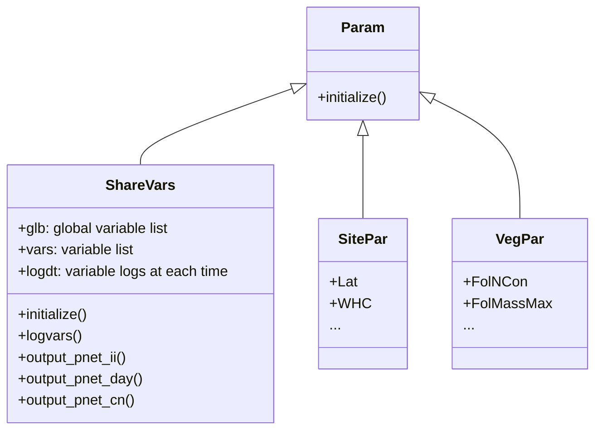

# Developer Notes

The structure of basic objects. 

For each process (e.g., phenology, photosynthesis) function, we update all variable values at the end of the function so that it is clear which variables are updated by the function.

For quick reference, [here's a summary of equations used in the model](../doc/PnET-CN%20equations.svg), which can be downloaded for better visualization.

