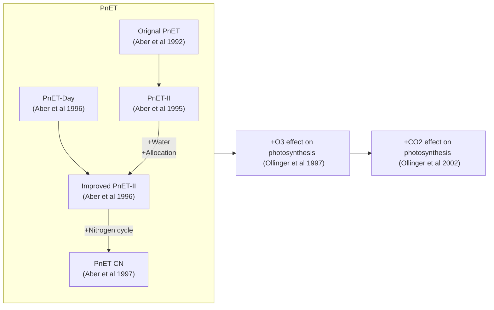
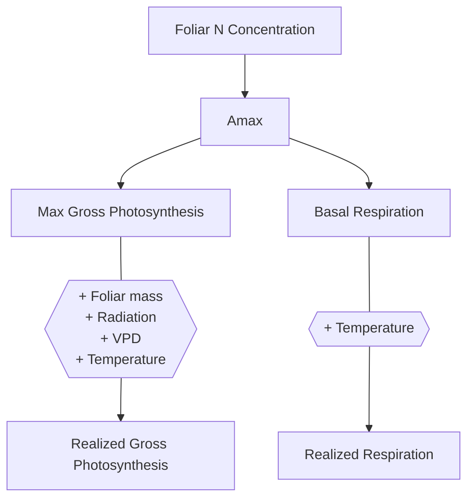

# PnET model family

PnET stands for **P**hotosy**n**thesis and **E**vapo**T**ranspiration, it's a simple lumped-parameter forest ecosystem model designed to simulate the effects of climate change, disturbance, and biogeochemical perturbations on coupled $C$, $H_2O$, and $N$ cycling.

The PnET model family consists of several models including:

- [The original PnET](https://doi.org/10.1007/BF00317837)
- [PnET-Day](http://www.jstor.org/stable/4221255)
- [PnET-II](http://www.int-res.com/abstracts/cr/v05/n3/p207-222)
- [PnET-CN](https://linkinghub.elsevier.com/retrieve/pii/S0304380097019534)

In this package, we currently provide PnET-II, PnET-Day, and PnET-CN. Note that the PnET-II model is actually an improved version of the original paper ([Aber et al 1995](https://doi.org/10.1007/BF00317837)), it also incorporates some parts of the PnET-Day model ([Aber et al 1996](http://www.jstor.org/stable/4221255)).

Here is a figure summarizing the milestones in model development and their references:

## Model Overview

> The model equations were extracted from the MATLAB and C++ code downloaded from the [official website](https://www.pnet.sr.unh.edu/).

Notations:

> A table of all variables and descriptions can be found [here](/doc/paramters_table.md).

Unless it's obvious, I use the following superscripts to specifically represent the time scale of a variable:

- $t$ is a general time scale
- $d$ is day
- $m$ is month
- $k$ is year

Colors are used to distinguish different variable types:

- $\textcolor{lime}{Observed\ variables}$, these variables are obtained from data, e.g., temperature and precipitation records.
- $\textcolor{cyan}{Prescribed\ variables}$, these variables are either fixed by the models or can be calibrated by users.

The following are the major modules encoded in the PnET model framework:

<<<<<<< HEAD
<<<<<<< HEAD
=======
>>>>>>> fb68df9 (Update doc)
- **[AtmEnviron](/doc/atm_environ.md)**: atmospheric environmental variables.
- **[Phenology](/doc/phenology.md)**: controls growing season timing and length, mainly consists of start of leaf development (start-of-season, SOS), start of woody growth, leaf senescence, and leaf fully fall (end-of-season, EOS).
- **[Photosynthesis](/doc/photosynthesis.md)**: determines carbon productivity, respiration, and leaf development.
- **[Water Balance](/doc/water_balance.md)**: controls water cycling and impacts of water availability on photosynthesis.
- **[Soil Respiration](/doc/soil_respiration.md)**: carbon reparation in soil.
- **[Allocation](/doc/allocation.md)**: allocates monthly and annual carbon gain for growth and respiration.
- **[CNTrans](/doc/cntrans.md)**: calculates litterfall and transfers to soil organic matter.
- **[Decomp](/doc/decomp.md)**: calculates C and N mineralization and nitrification and also matches N availability with plant N demand to determine N uptake. In the code scripts, the NUptake routine in Aber et al 1997, which combines N availability with the strength of plant demand to determine the uptake of N into the PlantN pool, is also included in this module.
- **[Leach](/doc/leach.md)**: calculates leaching losses of nitrate.
<<<<<<< HEAD

Different models include different modules above and may adapt particular parts, except for **[AtmEnviron](/doc/atm_environ.md)**, which is the same across all models.
=======
- **[AtmEnviron](/doc/AtmEnviron.md)**: atmospheric environmental variables.
- **[Phenology](/doc/Phenology.md)**: controls growing season timing and length, mainly consists of start of leaf development (start-of-season, SOS), start of woody growth, leaf senescence, and leaf fully fall (end-of-season, EOS).
- **[Photosynthesis](/doc/Photosynthesis.md)**: determines carbon productivity, respiration, and leaf development.
- **[Water Balance](/doc/Water%20Balance.md)**: controls water cycling and impacts of water availability on photosynthesis.
- **[Soil Respiration](/doc/Soil%20Respiration.md)**: carbon reparation in soil.
- **[Allocation](/doc/Allocation.md)**: allocates monthly and annual carbon gain for growth and respiration.
- **[CNTrans](/doc/CNTrans.md)**: calculates litterfall and transfers to soil organic matter.
- **[Decomp](/doc/Decomp.md)**: calculates C and N mineralization and nitrification and also matches N availability with plant N demand to determine N uptake. In the code scripts, the NUptake routine in Aber et al 1997, which combines N availability with the strength of plant demand to determine the uptake of N into the PlantN pool, is also included in this module.
- **[Leach](/doc/Leach.md)**: calculates leaching losses of nitrate.

Different models include different modules above and may adapt particular parts, except for **[AtmEnviron](/doc/AtmEnviron.md)**, which is the same across all models.
>>>>>>> e8ceb20 (More documentation)
=======

Different models include different modules above and may adapt particular parts, except for **[AtmEnviron](/doc/atm_environ.md)**, which is the same across all models.
>>>>>>> fb68df9 (Update doc)

### PnET-Day

PnET-Day is the simplest model in this family, it only simulates [Photosynthesis](/doc/photosynthesis.md). So, this model only includes [AtmEnviron](/doc/atm_environ.md), [Phenology](/doc/phenology.md), and [Photosynthesis](/doc/photosynthesis.md).
<<<<<<< HEAD

=======
>>>>>>> fb68df9 (Update doc)

### PnET-II

PnET-II includes all 6 modules sequentially ([AtmEnviron](/doc/atm_environ.md), [Phenology](/doc/phenology.md), [Photosynthesis](/doc/photosynthesis.md), [Water Balance](/doc/water_balance.md), [Soil Respiration](/doc/soil_respiration.md), [Allocation](/doc/allocation.md)). 
<<<<<<< HEAD

=======
>>>>>>> fb68df9 (Update doc)

### PnET-CN

<<<<<<< HEAD
<<<<<<< HEAD
PnET-CN builds upon PnET-II and includes nitrogen cycling. It introduces [CNTrans](/doc/cntrans.md), [Decomp](/doc/decomp.md), [Leach](/doc/leach.md) modules and modifies the [Allocation](/doc/allocation.md) module.
=======
PnET-CN builds upon PnET-II and includes nitrogen cycling. It introduces [CNTrans](/doc/CNTrans.md), [Decomp](/doc/Decomp.md), [Leach](/doc/Leach.md) modules and modifies the [Allocation](/doc/Allocation.md) module.

### PnET-Daily

PnET-Daily is a daily scale model while other models in the family are monthly scale.

### PnET-SOM
>>>>>>> e8ceb20 (More documentation)
=======
PnET-CN builds upon PnET-II and includes nitrogen cycling. It introduces [CNTrans](/doc/cntrans.md), [Decomp](/doc/decomp.md), [Leach](/doc/leach.md) modules and modifies the [Allocation](/doc/allocation.md) module.
>>>>>>> fb68df9 (Update doc)

