# Water Balance

This routine deals with water cycling and estimate the realized photosynthesis affected by water stress. Here are the variables involved (See [variables_table](/doc/paramters_table.md) for description):

- $\text{TotPrec}$: Annual accumulated precipitation.
- $\text{Evap}$: Evaporation.
- $\text{Trans}$: Transpiration.
- $\text{ET}$: Evapotranspiration.
- $\text{TotEvap}$: Annual accumulated evaporation.
- $\text{Drainage}$: Drainage.
- $\text{TotDrain}$: Annual accumulated drainage.
- $\text{TotTrans}$: Annual accumulated transpiration.
- $\text{SnowPack}$: Snowpack of the site.
- $\text{SnowMelt}$: The amount of snow melt.
- $\text{WaterIn}$: Input water amount.
- $\text{CanopyGrossPsnRate}$: Canopy gross photosynthesis rate with water stress.
- $\text{GrsPsn}$: Gross photosynthesis with water stress.
- $\text{TotGrossPsn}$: Annual accumulated total gross photosynthesis.
- $\text{NetPsn}$: Net photosynthesis with water stress.
- $\text{TotPsn}$: Annual accumulated total net photosynthesis.
- $\text{WUE}$: Water use efficiency.
- $\text{Water}$: Water amount.
- $\text{DWater}$: Water stress effect on photosynthesis.
- $\text{Dwatertot}$: Annual water stress.
- $\text{DwaterIx}$: Total water stress throughout the entire simulation period.

```mermaid
flowchart

p[💦 Precipitation] --> inter{{Interception}}
p[💦 Precipitation] --> evap{{Evaporation}}
p[💦 Precipitation] --> pr[☔︎ Remained Precipitation]
p[💦 Precipitation] --> s[❄ Snow]
s --> sm[Snow Melt]
sm --> pwi[Potential Water In]
pr --> pwi[Potential Water In]
pwi --> ff{{Fast Flow}}
pwi --> wi[🚰 Water In]
wi --> Drainage{{Drainage}}
wi --> ws[Water Storage]
wi --> wu[🌱 Water Uptake]
wu --> trans{{Transpiration}}
```

## Water input

Precipitation is the only water input source. When precipitation drops, a constant fraction of it ($\textcolor{cyan}{\text{PreclntFrac}}$) is intercepted and evaporated. This includes both rain interception and evaporation (sublimation) from canopy and ground level snow:

$$\text{Evap} = \textcolor{lime}{\text{Prep}} \cdot \textcolor{cyan}{\text{PrecIntFrac}}$$

The rest of the precipitation ($\text{PrepRemain}$) is dropped in the form of snow or rain depends on temperature:

$$\text{PrepRemain} = \textcolor{lime}{\text{Prep}} - \text{Evap}$$

$$\text{SnowFrac} = \begin{cases}
    1 & T_{avg} \le -5 \\
    (T_{avg} - 2) / -7 & -5 < T_{avg} < 2 \\
    0 & T_{avg} \ge 2
\end{cases}$$

where $\text{SnowFrac}$ is the fraction of precipitation falling as snow.

Potentially, the accumulated snow pack on the ground should be:

$$\text{PotSnowPack}^t = \text{SnowPack}^{t-1} + \textcolor{lime}{\text{Prep}^t} \cdot \text{SnowFrac}^t$$

But, depends on temperature, a portion of snow may be melted:

$$\text{SnowMelt} = \begin{cases}
    \min(0.15 \cdot \min(1, T_{avg}) \cdot \text{Dayspan}, \text{PotSnowPack}) & \text{PotSnowPack} > 0 \\
    0 & \text{PotSnowPack} = 0
\end{cases}$$

So, the actual snow pack is:

$$\text{SnowPack} = \text{PotSnowPack} - \text{SnowMelt}$$

The melted snow adds to the potential amount of water input ($\text{PotWaterIn}$) along with the remaining precipitation after considering snow fraction:

$$\text{PotWaterIn} = \text{SnowMelt} + \text{PrepRemain} \cdot (1 - \text{SnowFrac})$$

However, there is a small fast flow proportion:

$$\text{FastFlow} = \textcolor{cyan}{\text{FastFlowFrac}} \cdot \text{PotWaterIn}$$

So, the actual input water is:

$$\text{WaterIn} = \text{PotWaterIn} - \text{FastFlow}$$

We can also calculate the average daily input water in this month if the current time scale is monthly:

$$\text{WaterIn}^d = \text{WaterIn}^m / \text{Dayspan}^m$$

## Transpiration

Transpiration requires photosynthesis, so if the current period is out of growing season, i.e., $\text{GDDTot}^t < \textcolor{cyan}{\text{GDDFolStart}}$ or $\text{GDDTot}^t > \textcolor{cyan}{\text{GDDFolEnd}}$, transpiration would be 0. If this is the case, we update the following variables:

- $\text{DWater} = 1$
- $\text{Water}^t = \text{Water}^{t-1} + \text{WaterIn}$
- $\text{MeanSoilMoistEff} = 1$
- $\text{Trans} = 0$
- $\text{NetPsn} = 0$
- $\text{GrsPsn} = 0$

Otherwise, the current period is within the growing season, we first calculate water use efficiency ($\text{WUE}$) by:

$$\text{WUE} = \textcolor{cyan}{\text{WUE}_{const}} / \text{VPD}$$

Convert units, and calculate daily potential transpiration without water stress:

$$\text{CanopyGrossPsnMG} = \text{CanopyGrossPsn} \cdot 1000 \cdot 44 / 12$$

$$\text{PotTrans}^d = \text{CanopyGrossPsnMG} / \text{WUE} / 10000$$

If $\text{PotTrans}^d > 0$, For each day $d$ in the month, current potential available water is:

$$\text{PotWater}^d = \text{Water}_{d-1} + \text{WaterIn}^d$$

so the transpiration for the day is:

$$\text{Trans}^d = \begin{cases}
    \text{PotTrans}^d & \text{PotWater}^d \geq \text{PotTrans}^d / \textcolor{cyan}{\text{f}} \\
    \text{PotWater}^d \cdot \textcolor{cyan}{\text{f}} & \text{PotWater}^d < \text{PotTrans}^d / \textcolor{cyan}{\text{f}}
\end{cases}$$

Then, the actual daily water after transpiration is:

$$\text{Water}^d = \text{PotWater}^d - \text{Trans}^d$$

And the accumulated transpiration for the month is:

$$\text{Trans}^m = \text{Trans}^d \cdot \text{Dayspan}^m$$

The accumulated total soil moisture effect for the month is:

$$\text{TotSoilMoistEff}^m = \Sigma_{d=1}^{\text{Dayspan}^m} {\min(\text{Water}^d, \textcolor{cyan}{\text{WHC}}) / \textcolor{cyan}{\text{WHC}}}^{1.0 + \textcolor{cyan}{\text{SoilMoistFact}}}$$

The mean daily soil moisture effect on soil respiration is:

$$\text{MeanSoilMoistEff}^m = \min(1, \text{TotSoilMoistEff}^m / \text{Dayspan}^m)$$

Then, the effect of water on gross photosynthesis is:

$$\text{DWater} = \text{Trans} / \text{PotTrans}$$

The accumulated $\text{DWater}$ is:

$$\text{DWatertot} = \Sigma_{i=1}^{t} (\text{DWater}^i \cdot \text{Dayspan}^i)$$

<!-- $$\text{DWaterIx} = \Sigma_{i=1}^{12} \text{Dayspan}^m$$ -->

## Water stress on photosynthesis

If the site does not have water stress ($\textcolor{cyan}{\text{WaterStress}} = 0$), then $\text{DWater} = 1$.

Finally, we can calculate the canopy gross photosynthesis rate and monthly value with water stress effect:

$$\text{CanopyGrossPsnRate} = \text{CanopyGrossPsn} \cdot \text{DWater}$$

$$\text{CanopyGrossPsnAct} = \text{CanopyGrossPsnRate} \cdot \text{Dayspan}$$

$$\text{GrsPsn} = \text{CanopyGrossPsnAct}$$

And, the net photosynthesis with water stress is:

$$\text{NetPsn} = (\text{CanopyGrossPsnRate} - (\text{DayResp} + \text{NightResp}) \cdot \text{FolMass}) \cdot \text{Dayspan}$$

## Water storage 

The amount of water available at this time step is:

$$\text{Water}^t = \text{Water}^{t-1} + \text{WaterIn}^t$$

If current amount of water is greater than the water holding capacity of the site ($\textcolor{cyan}{\text{WHC}}$), i.e., $\text{Water}^t > \textcolor{cyan}{\text{WHC}}$, the additional water would drain away and $\text{Water}^t$ would just be $\textcolor{cyan}{\text{WHC}}$.

$$\text{Drainage}^t = \max(0, \text{Water}^t - \textcolor{cyan}{\text{WHC}})$$

$$\text{Water}^t = \textcolor{cyan}{\text{WHC}}$$

Otherwise, $\text{Drainage}^t = 0$.

Finally, we can summarize the following accumulated variables at the current time step:

- $\text{TotDrainage} = \text{Drainage} + \text{FastFlow}$
- $\text{TotTrans} = \text{TotTrans} + \text{Trans}$
- $\text{TotPsn} = \text{TotPsn} + \text{NetPsn}$
- $\text{TotDrain} = \text{TotDrain} + \text{Drainage}$
- $\text{TotPrep} = \text{TotPrep} + \textcolor{lime}{\text{Prep}}$
- $\text{TotEvap} = \text{TotEvap} + \text{Evap}$
- $\text{TotGrossPsn} = \text{TotGrossPsn} + \text{GrsPsn}$
- $\text{TotET} = \text{Trans} + \text{Evap}$
